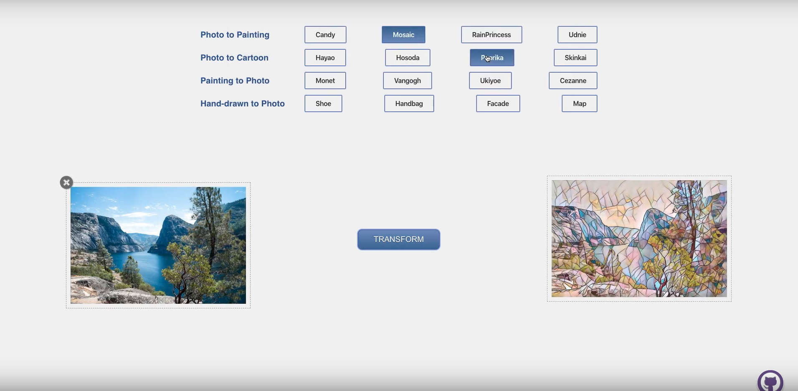

# StyleTransferApp
> This is the final project for CS6476 Computer Vision. We aim to develope a style transfer application.

## Introduction

Style transfer is really interesting and popular in our daily life. There are so many style transfer apps in the google shop or ios store. With the developemnt of deeping learning, more and more style transfer methods are proposed. We want to explore it.

For our application, we supports four different kinds of style transfer tasks with 16 different styles.

1. Photo to painting (by CNN)
2. Photo to cartoon image (by CartoonGAN)
3. Painting to photo (by CycleGAN)
4. Hand-written image to photo (by Pix2Pix)

Here is a screenshot of our application: 




## Architecture
- The front end is developed by React.
- The image upload server is developed by NodeJs and Express.
- The backend is developed by Flask.
- The CNN and GAN models are developed by Python and Pytorch.


## Installation and Development


### Prerequisite:

- npm
- python3
- cloudinary account

### Installation

#### Front end

- To start the client of the web application, under the **"frontend/client/"** directory, run the following commands to install the dependencies and start the server:

```
yarn install
yarn start
```

- To start the image uploading server, under the **"frontend/server/"** directory, run the following commands to install the dependencies and start the server. Here, please remember to put the cloud_name, api_key and api_secret of your cloudinary in the **"frontend/server/config.js"** file.

```
npm install
npm run dev
```

#### Back end

- At first, you can download the corresponding trained models from our [Google Drive](https://drive.google.com/drive/folders/1eRWshgV4mH47umHrR2q1KpcpPHLIP-TY?usp=sharing) and put them into the **"backend/trained_models"**.
- Then, you should put the cloud_name, api_key and api_secret of your cloudinary in the **"backend/settings.py"** file,
- To start the backend server, under the **"backend/"** directory, run run the following commands to install the dependencies and start the server.

```
pip3 install -r requirements.txt
python3 api.py
```

To have a good try of the application, please remember to start the image uploading server and backend server at first.


## Usage example

The short presentation and demo of our application is shown in the following video:

[](https://www.youtube.com/watch?v=hmLCBH1_XRU)

